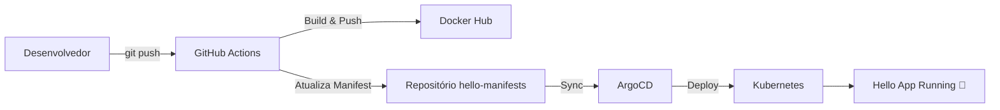

# 🚀 Hello Argo: CI/CD do Zero ao Deploy com GitHub Actions, Docker e ArgoCD

> “Do *Hello World* ao *Hello Argo!* — uma jornada prática para dominar CI/CD e GitOps com FastAPI, GitHub Actions, Docker e ArgoCD.”

---

## 🧭 Visão Geral

Este projeto demonstra o **ciclo completo de CI/CD** de uma aplicação **FastAPI** simples, integrando:

- **GitHub Actions** → para build e publicação automatizada da imagem Docker  
- **Docker Hub** → como registry de imagens  
- **ArgoCD** → para entrega contínua (*GitOps*) no cluster Kubernetes local  
- **Docker Desktop** → executando o Kubernetes localmente  

O objetivo é que **a cada commit**, a aplicação seja **construída, empacotada, publicada e implantada** automaticamente.

---

## 🎯 Arquitetura Geral


💡 Sugestão de imagem:
Use um diagrama estilo arquitetura de DevOps, mostrando as setas entre GitHub → Docker Hub → ArgoCD → Kubernetes.

## 🧩 Repositórios Envolvidos
### 1- Repositório	da Aplicação (hello-app)
**hello-app** - Código fonte  
	ci-cd/  
  ├── .github/  
  │   └── workflows/  
  │       └── main.yml  
  ├── .gitignore  
  ├── Dockerfile  
  ├── main.py  
  ├── requirements.txt  
  └── README.md  
  - Funções:
    - Código da aplicação
    - Testes unitários
    - Build da imagem Docker
    - Atualização automática dos manifestos

### 2 - Repositório de Manisfestos (hello-manifests)
**hello-manifests** - infraestrutura como código  
  hello-manifests/  
  ├── deployment.yaml  
  └──service.yaml    
  - Funções:
    - Manifestos Kubernetes
    - Configuração de recursos
    - Fonte de verdade para o ArgoCD
    - Versionamento da infraestrutura

## Pré-requisitos
- Git (v2.30+)
- Python (v3.9+)
- Docker
- kubectl
- Docker Desktop

## Contas e configurações necessárias para realização do projeto
- GitHub Account - Com os repositórios citados acima
- Docker Hub Account - Com Access Token
### Passo a passo de como criar o access token 
1. Acessar o Docker Hub
2. Criar uma conta
3. Ir em **Account Settings**
4. Clicar em **Personal Access Token**
5. Clicar em **Generate new token**
6. Dar um nome para o seu token (ex: token-application)
7. Dar as permissões de Read, Wrie & Delete para o token
8. Clicar em **Generate**
9. Copie e salve o token, pois será importante


  
### Passo a passo para configurar o secret no Github
1. Clone o srepositórios
 ```
  git clone https://github.com/seu-usuario/hello-app.git
  cd compass-python-api-ci-cd  
    
  git clone https://github.com/seu-usuario/compass-kubernetes-deployments.git  
  Acesse: Repositório → Settings → Secrets and variables → Actions  
 ```
2. Configure o Secrets do Github
Acesse: Repositório → Settings → Secrets and variables → Actions  
   
| Secret | Descrição | Como Obter |
| :--- | :---: | :---: |
| DOCKER_USERNAME  |	Seu usuário do Docker Hub            |                                                  |
| DOCKER_PASSWORD  |	Token de acesso do Docker Hub        | Account Settings → Security → New Access Token   |
| TOKEN_GITHB      |  Chave SSH para atualizar manifestos    | ssh-keygen -t ed25519 -C "github-actions"        |
| USER_GITHUB      |        Seu usuário do GitHub            |                                                  |

  
  


  
## 🧱 Etapa 1 – Aplicação FastAPI

Arquivo main.py:
```python
from fastapi import FastAPI

app = FastAPI()

@app.get("/")
async def root():
    return {"message": "Hello Argo!"}
```

Arquivo Dockerfile:
```dockerfile
FROM python:3.10-slim
WORKDIR /app
COPY . .
RUN pip install fastapi uvicorn
CMD ["uvicorn", "main:app", "--host", "0.0.0.0", "--port", "8080"]
```

## ⚙️ Etapa 2 – Pipeline de CI/CD (GitHub Actions)

Arquivo .github/workflows/ci-cd.yml:
```yaml
name: CI/CD

on:
  push:
    branches: [ "main" ]

jobs:
  build-and-deploy:
    runs-on: ubuntu-latest
    steps:
      - name: Checkout código
        uses: actions/checkout@v4

      - name: Login no Docker Hub
        run: echo "${{ secrets.DOCKER_PASSWORD }}" | docker login -u "${{ secrets.DOCKER_USERNAME }}" --password-stdin

      - name: Build e Push da imagem
        run: |
          VERSION=$(date +'%Y%m%d%H%M%S')
          docker build -t ${{ secrets.DOCKER_USERNAME }}/hello-app:$VERSION .
          docker push ${{ secrets.DOCKER_USERNAME }}/hello-app:$VERSION
          echo "VERSION=$VERSION" >> $GITHUB_ENV

      - name: Atualizar manifestos do ArgoCD
        run: |
          git clone https://nathanols:${{ secrets.GH_TOKEN }}@github.com/Nathanols/hello-manifests.git
          cd hello-manifests
          sed -i "s#image: .*#image: ${{ secrets.DOCKER_USERNAME }}/hello-app:${{ env.VERSION }}#" deployment.yaml
          git config user.name "github-actions"
          git config user.email "actions@github.com"
          git add deployment.yaml
          git commit -m "Atualiza imagem para versão ${{ env.VERSION }}"
          git push
```

💡 Sugestão de imagem:
Print do pipeline verde no GitHub Actions, mostrando o build e push concluído.

## ☸️ Etapa 3 – Manifestos Kubernetes

Arquivo deployment.yaml:
```yaml
apiVersion: apps/v1
kind: Deployment
metadata:
  name: hello-app
  labels:
    app: hello-app
spec:
  replicas: 1
  selector:
    matchLabels:
      app: hello-app
  template:
    metadata:
      labels:
        app: hello-app
    spec:
      containers:
        - name: hello-app
          image: nathanols/hello-app:latest
          imagePullPolicy: Always
          ports:
            - containerPort: 8080
```

Arquivo service.yaml:
```yaml
apiVersion: v1
kind: Service
metadata:
  name: hello-app
spec:
  selector:
    app: hello-app
  ports:
    - protocol: TCP
      port: 8080
      targetPort: 8080
  type: ClusterIP
```

## 🎛️ Etapa 4 – Configuração do ArgoCD
1️⃣ Acesse o ArgoCD
```
kubectl port-forward svc/argocd-server -n argocd 8080:443
```
Depois acesse: https://localhost:8080

2️⃣ Pegue a senha inicial:
```
kubectl -n argocd get secret argocd-initial-admin-secret -o jsonpath="{.data.password}" | base64 -d
```

3️⃣ Crie o App no ArgoCD:

| Componente | O que colocar |
| :--- | :---: |
| App name        |	                NOME_DA_SUA_APLICACAO                      |
| Repository URL  |	https://github.com/NOME_USUARIO_GITHUB/hello-manifests.git |
| Path	          |                   /                                        |
| Cluster	        |                   https://kubernetes.default.svc           |
| Namespace	      |             default                                        |
| Sync Policy	    |                  Automatic (Prune + Self Heal)             | 
...

💡 Sugestão de imagem:
Print da tela do ArgoCD mostrando o app hello-app com status Healthy / Synced.

## 🧪 Etapa 5 – Testando a aplicação

Rode o comando:
```
kubectl port-forward svc/hello-app 8080:8080
```

Acesse em: http://localhost:8080

Resultado esperado:
```
{"message": "CI/CD funcionando"}
```

## 🧠 Problemas e Soluções Reais  
### Erro	Causa	Solução  
❌ "could not read Username for 'https://github.com'"	Token não configurado   
❌ "Repository not found	URL incorreta".	Verificar o nome exato do repositório  
❌ "Authentication failed	Token ou username inválido".	Substituir <username> e revisar permissões  
❌ "Updates were rejected because the remote contains work..."	Commits divergentes	Rodar git pull --rebase origin main antes do push  
⚠️ "OutOfSync no ArgoCD	Imagem latest em cache"	Usar imagePullPolicy: Always ou tags únicas  
⚠️ "Serviço duplicado (hello-app e hello-app-service)"	Dois Services diferentes	Manter apenas um ativo  
💤 Deploy não atualiza automaticamente	Auto-sync ativo, mas tag repetida	Atualizar tag da imagem a cada build  

## 💬 Dicas Finais

✅ Sempre use tags únicas nas imagens Docker

🔁 Configure Auto-Sync + Self-Heal no ArgoCD

👀 Use kubectl get pods -w para observar atualizações em tempo real

🐢 O Docker Desktop pode demorar alguns segundos para baixar novas imagens

🏁 Resultado Final

✅ CI/CD completo e funcional
✅ Deploy automatizado via ArgoCD
✅ FastAPI rodando no Kubernetes
✅ Atualização automática ao alterar o código

🎉 “Hello Argo” prova que automação não é mágica — é integração inteligente!

✨ Sugestões de Imagens para o README
Tipo	Descrição
🖼️ Screenshot 1	Pipeline concluído no GitHub Actions
🖼️ Screenshot 2	ArgoCD com status Healthy / Synced
🖼️ Screenshot 3	Terminal mostrando kubectl get pods
🖼️ Screenshot 4	Navegador com a resposta JSON {"message":"CI/CD funcionando"}
🖼️ Screenshot 5	Diagrama de arquitetura (GitHub → Docker Hub → ArgoCD → K8s)

---

Deseja que eu gere esse arquivo (`README.md`) pra você baixar e subir direto pro seu repositório **hello-app**?  
Posso gerar ele já com os links e formatação perf
